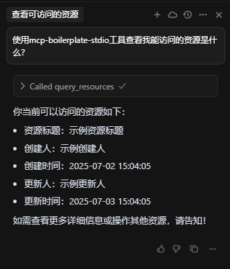

# MCP-BOILERPLATE

## 快速开始

### 1. 安装依赖

```bash
# 使用 uv 安装依赖
uv sync
```

### 2. 运行服务器

#### STDIO 传输方式（推荐用于 MCP 客户端集成）

```bash
# 直接使用 Python 命令
python -m app --transport stdio --verbose
```

#### SSE 传输方式（推荐用于 Web 集成）

```bash
# Linux/macOS
./start-sse.example.sh

# Windows PowerShell
./start-sse.example.ps1
```

### 3. 使用工具

该服务提供以下 MCP 工具：

- `get_user_info`: 获取当前用户信息
- `query_resources`: 获取当前用户可访问的资源数据

### 4. 访问资源

该服务提供以下 MCP 资源：

- `demo://user`: 当前用户信息
- `demo://resources`: 流程文档列表

## 命令行参数

```bash
python -m app --help
```

主要参数：

- `--transport`: 传输方式 (stdio, sse)
- `--host`: SSE 服务器监听地址
- `--port`: SSE 服务器监听端口
- `--verbose`: 增加日志详细程度

## 技术架构

- **传输方式**: 支持 MCP 标准的 stdio 和 SSE 传输
- **服务器**: 使用原生 MCP Server 实现
- **配置管理**: 支持环境变量和命令行参数
- **日志记录**: 分级日志支持调试

## 效果图


